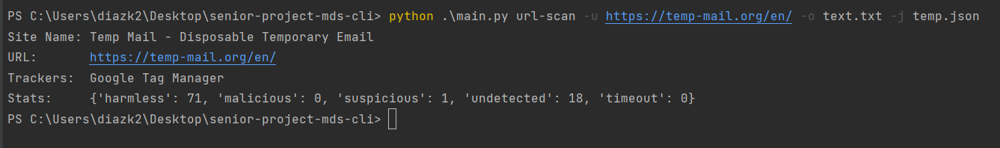
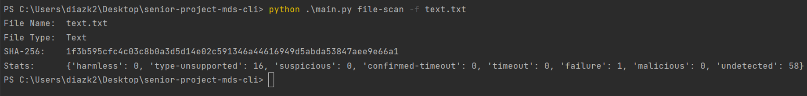

# Malware Detection System - Command Line Tool
 
## Purpose

Allows users to scan hyperlinks and files to detect malware via the terminal

## Installation

**Install not available yet**

## Usage

**py ./main url-scan -u [Hyperlink] -o output.txt -j jsonOutput.json**   
**py ./main file-scan -f [File Path] -o output.txt -j jsonOutput.json**

Users can optionally use -o to output a text file or -j to output a json file

## Examples

**URL**

**File**

